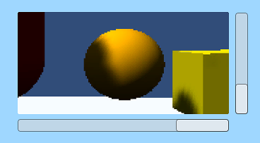

# Mask

A **Mask** is not a visible UI control but rather a way to modify the appearance of a control's child elements. The mask restricts (ie, "masks") the child elements to the shape of the parent. So, if the child is larger than the parent then only the part of the child that fits within the parent will be visible.

## Properties

|**Property:** |**Function:** |
|:---|:---|
|**Show Graphic** |Should the graphic of the masking (parent) object be drawn with alpha over the child object? |

## Description

A common use of a Mask is to show a small section of a large Image, using say a Panel object (menu: **GameObject &gt; Create UI &gt; Panel**) as a "frame". You can achieve this by firstly making the Image a child of the Panel object. You should position the Image so that the area that should be visible is directly behind the Panel area.

Then, add a Mask component to the Panel. The areas of the child Image outside the panel will become invisible since they are masked by the shape of the Panel.

If the image is then moved around then only the part revealed by the Panel will be visible. The movement could be controlled by [Scrollbars](script-Scrollbar.md) to create a scrollable viewer for a map, say.

## Implementation

Masking is implemented using the stencil buffer of the GPU.

*The first Mask element writes a 1 to the stencil buffer
*All elements below the mask check when rendering, and only render to areas where there is a 1 in the stencil buffer
*Nested Masks will write incremental bit masks into the buffer, this means that renderable children need to have the logical & of the stencil values to be rendered.
